# Sequence to Sequence Learning with Neural Networks
作者：Ilya Sutskever, Oriol Vinyals, Quoc V. Le  
Conference: NeurlIPS 2014

## 先大致介紹一下 Seq2seq......
* 什麼是 "Sequence (序列)" ？  
  - 具有時序性，為連續性的資料  
  - Ex: 一句話、一段音訊、價格趨勢......等等
* 所以 Sequence to sequence 顧名思義就是 "把一組時序性的資料轉成另一組時序性的資料"
  - Ex: 演講逐字稿(聲音 -> 文字)、翻譯(一種語言 -> 另一種語言)、文章重點擷取(一個沈長的序列 -> 很短的序列)
* Seq2seq 架構的誕生
  - 在當時，處理序列資料都是以 **RNN** 處理，但是 RNN 輸入、輸出架構是固定的  
  (1 維 -> N 維、N 維 -> 1 維、N 維 -> N 維、)
  - 所以無法實現 **"輸入、輸出長度不同"** 的灀況 (N維 -> M 維)
  - **Seq2seq 架構就這樣被提出來了**
    - 簡易架構示意圖如下：  
      

      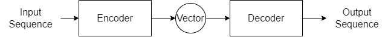
      

    - Seq2seq 的主要特色即是 Encoder-Decoder 架構
    - Encoder、Decoder 為兩個各自的模型 (Paper 中使用的是 LSTM，也可以用 CNN、Attention......等等)
    - Encoder 會把輸入序列轉成一個向量 (vector)，可以想像成在做 N to 1 RNN
    - Decoder 再把前者產生的向量轉成輸出序列，可以想像成在做 1 to N RNN
    - 上述兩者合起來，就可以達到 N to M 的序列轉換效果

## 這邊開始從論文脈絡做整理
### Introduction
> 備註：  
> 當時機器學習的時空背景為深度學習正要崛起的時候，但仍有很多任務不如統計方法的機器學習
* DNN (深度神經網路) 在語音辨識 (Speech Recognition)物件偵測 (Object Dection) 已有良好表現
  - DNN 強的的點在於它能夠平行運算
  - 然而，DNN 存在一個很大的限制：輸入、輸出的維度要是固定的 (fixed)
* 所以這篇論文提出了基於 LSTM，又可以達成 Sequence to sequence 的架構：
  

    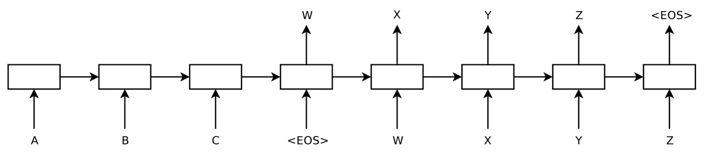
  

  - 我們可以把上圖視為左、右兩部分
  

    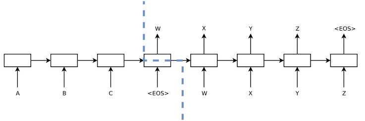
  

  
  - 左側的部分就是 **Encoder**，而右側就是 **Decoder**。兩者架構皆使用 LSTM
  - 假設現在輸入一個序列 "A B C \<EOS>"
    > \<EOS>: 表示 "End of sentence"，本篇論文使用的特殊 Token，用來告訴 Model 句子結束
  - 我們把 "A B C \<EOS>" 丟進 Encoder，Encoder 會把該序列轉成一個向量 (vector)
  - 得到新的向量後，我們就可以把該向量放進 Decoder，Decoder 就會"依序"生成對應的輸出
  - 根據 Decoder 所有的輸出結果，我們可以得到輸出序列 "W X Y Z \<EOS>"
  - 這樣我們就達成了 "A B C \<EOS>" -> "W X Y Z \<EOS>"，這種 Seq2seq 的效果
* 本篇論文在實驗時使用一個小技巧：**對輸入序列進行反轉 (Reverse)**，也因為這個動作，突破了以往認為 LSTM 無法處理比較長的句子的問題
* 經過實驗後也發現，本模型知道兩個句子間的相關性有多高 (意思越相近的兩個句子，兩者的"距離"就會越近)
### The Model
* RNN (Recurrent Neural Network)
  - 一般來說，處理序列資料第一個想到的解法就是用 RNN
  

    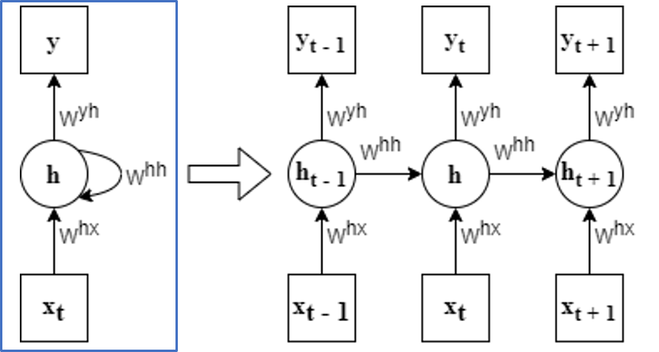
  

  - 藍色框框內為一個簡易的 RNN 示意架構，箭頭右方為該 RNN 的展開
  > 符號介紹:  
  > *T*: 讀完序列的總時間(也相當於序列長度)  
  > *t*: 當前的時間點  
  > *(x1, x2, ......xT)*: 輸入序列  
  > *(y1, y2, ......yT)*: 輸出序列
  > *h*: 隱藏層 (hidden layer)
  - 簡單來說，RNN 的使用方法如下：
    - 在當前時間 t，RNN 會把 xt 吃進來丟進以藏層 ht
    - 此時隱藏層 ht 除了擁有此時的輸入 xt 的資訊以外，他還會把吃進 xt 前的自己 (相當於右方展開圖中的 ht - 1) 也吃進來，這就是 RNN 遞迴 (Recurrent) 的部分
    - 所以 yt 除了擁有 xt 的訊息外，因為 RNN 遞迴的效果，隱藏層 ht 也吃到了前面幾個時間點的輸入資訊，使得 yt 也富含了 y1 ~ yt - 1 的資訊
  - 以式子表示的話就如下圖所示：
  

    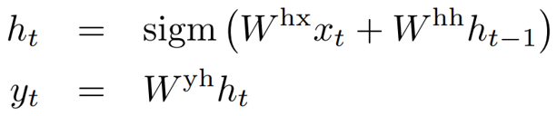
  

  - 然而，RNN 存在一個問題，也是我前面多次提到的：**輸入、輸出維度是被固定的**

* Cho et al. 提出的 Encoder-Decoder 架構
  - 本篇論文參考了 Cho et al. 提出的架構
  - 這是第一篇提出 Encoder-Decoder 架構的論文，使用這種架構就能夠完美解決掉 RNN 的樹入輸出限制問題
  - 下圖為 Cho 在論文提出的架構  
   ([5] K. Cho, B. Merrienboer, C. Gulcehre, F. Bougares, H. Schwenk, and Y. Bengio. Learning phrase represent-tations using RNN encoder-decoder for statistical machine translation. In Arxiv preprint arXiv:1406.1078, 2014
)
  

    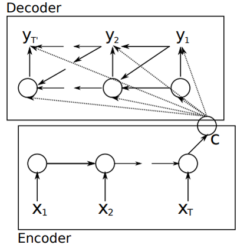
  

  - 然而，如果用 RNN 還是會有一個問題：長期依賴性
    > 長期依賴性問題：如果序列太長，RNN 可能會丟失台過久遠的資料，導致最後的輸出結果不盡理想
  - 要解決長期依賴性問題，最常使用的方法就是把 RNN 改成 **LSTM**
  
* LSTM
  - 我們可以把 LSTM 想像成在做**條件機率**
    > 符號介紹:  
    > *P(x|y)*: 條件機率，在 *y* 已經發生的前提下，*x* 也發生的機率是多小  
    > *T'*: 因為輸入、輸出的維度可能不同，所以這邊輸入的維度是用 *T'* 表示  
    > *v*: LSTM 先利用最後一層隱藏層得到的輸入維度
  

    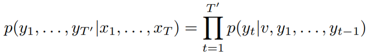
  

* 這邊論文和其他 LSTM 的相異點
  - 整理下來剛好是這篇 Paper 的三大主要貢獻
  1. 用了兩個 LSTM Model
     - 分別處理輸入、輸出序列 (也就是一個是 Encoder，一個是 Decoder)
     - 雖然參數量會提升，但 cost 是可被忽略的 (影響不大)
  2. 使用了**深層**的 LSTM
  3. 把序列丟進 Model 時，會先對序列進行反轉
     - Ex: 原本輸入 "a, b, c" 對映到 "𝛼, 𝛽, 𝛾"  
       反轉後變成 "c, b, a" 對映到 "𝛼, 𝛽, 𝛾" 

### Experiments
* 資料集介紹
  - 使用 WMT'14 English to French
  - 總共有 12M 條句子，其中有
    - 348M 個法文單字
    - 304M 個英文單字
  - 因為在深度學習中，每個字都是由一個向量 (vector) 表示，如果要把所有單字都放進來，勢必會消耗掉相當大量的儲存空間。所以這邊需要做些取捨：
    - 取 160,000 個最常用的英文單字
    - 取 80,000 個最常用的法文單字
    - 常用單字以外的字以 "UNK" 表示

* Decode 的部分
  - 實驗目的為使用成對的 原文-翻譯文 訓練出一個深度 LSTM
  - 寫成表達式一樣可以理解成在做條件機率。如下式所示， 本實驗的目標就是最大化 "如果給我們一段英文句子，能夠翻譯成正解的機率"
    > *S*: Source Sentence，要被翻譯的英文句子  
    > *T*: Correct Translation，翻譯後的正解法文句子  
    > 取 log 一部份原因是為了方便計算
    

      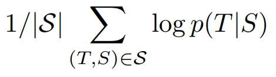
    

    - 訓練完成後，我們就可以根據 LSTM 得到最接近正解的翻譯句子是什麼 (如下式)
    

      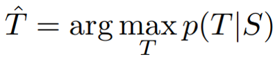
    

  - 在實驗中，尋找最佳路徑的方法為 left-to-right beam search decoder
    - 每個時步 (Timestep) 都會擴展固定數量的路徑
    - 隨著時步增加，需要消耗的儲存空間也會越來越多。所以這邊定移了一個數值 "B"，代表只會保留可能性最高的前 B 條路徑，剩下的都捨棄
    - 如果有路徑先遇到 "\<EOS\>"，則會將此句子加進候選集合 (set) 並將其從 Beam 移除
      > 補充：什麼是 Beam Search？  
      > Beam Search 比較的對象通常是 Greedy (貪婪演算法)，下方舉個例子
      >

      >
      > 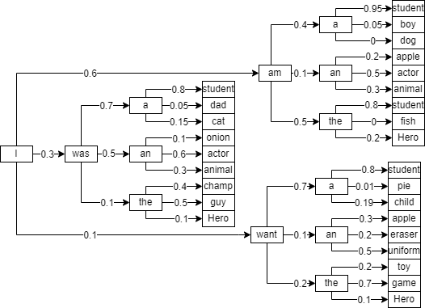
      > 

      > 
      > 假設我們希望機器生成句子 "I am a student"，且機器已知開頭第一個字為 "I"  
      > 上圖為 "I" 之後所有可能接的字，每條邊上的數字表示正確率  
      > * Greedy  
      >   貪婪演算法的該念就是"走當下最好的選擇"，所以在該例子選擇路徑如下：  
      >   

      >
      >   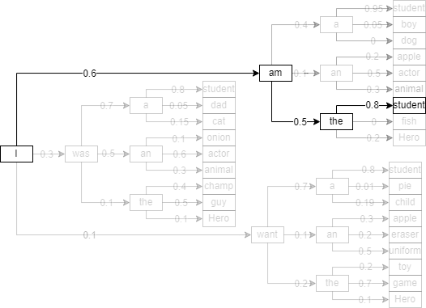
      >   

      >  
      >   最後輸出為 "I am the student"，並不是我們要的答案  
      >   其中，在選擇 "am" 的下一步，因為走 "the" 的路徑分數是三者最高的，所以這邊選擇走 "the"  
      > * Beam Search (假設 k = 2)  
      >   Beam Search 的概念為 "保留 k 個最佳選項'，也可以理解成 "對每條路徑做 k 次 Greedy"  
      >   最後結果取 "路徑分數總和最高" 的路徑  
      >   選擇示意圖如下：
      >   

      >
      >   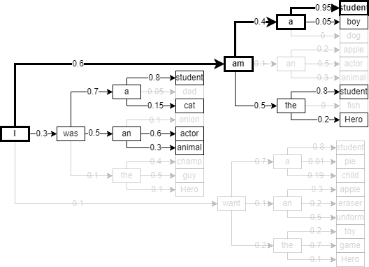
      >   

      >   
      >   Beam Search 每次在做選擇時都會保留 2 個分數最高的路徑  
      >   最終因為 "I am a student" 路徑總分是最高的 (1.85 分)，所以選擇這條路徑，得到正解  
* **輸入序列反轉 (Reversing the Source Sentences)**
    - 經過實驗發現，如果輸入句子有先進行反轉，訓練出來的結果會比原來好上許多
    - 論文中還沒辦法明確解釋原因，但作者認為有以下幾種可能
      - 短期依賴性問題
      - "Minimal time lag"  
        一個句子丟進 LSTM 後，第一個產生的字應該會是輸出序列的第一個字
        然而，輸出序列的第一個字通常也是和原文的第一個字最相關，但如果序列依正常順序丟進 LSTM，第一個字是最容易被 LSTM 遺忘的
        > Ex:  
        > "我很高" 會被翻譯成 "I am tall"  
        > 如果依原本的順序輸入，"我" 會先被丟進 LSTM，這樣會使得 "我" 和輸出的結果 "I" 的**距離**被拉遠

        如果我們再輸入時先將序列翻轉，那 LSTM 產生的第一個字就會離元輸入的第一個字比較進，就比較能夠做出正確的翻譯
        > Ex:  
        > "我很高" 會被翻譯成 "I am tall"  
        > 把輸入序列反轉成 "高很我"，那丟進 LSTM 後，"我" 跟 "I" 的距離就會被拉進了，這樣就更成讓 LSTM 保留 "我" 的語意
* 其他 Training Details
    - LSTM:
      - 使用深度 LSTM (4 層)
      - 每一層有 1000 個節點 (cell)，word embedding 的維度為 1000
    - 其他 Tips:
      - 參數初始化數值為 -0.08 ~ 0.08 的均勻分布 (Umiform Distribution)
      - 使用 Stochastic gradient descent，Learning rate 為 0.7。在 5 個 Epoch 後，Learning rate 每過半個 Epoch 就減半
      - Batch size: 128
      - 為避免梯度爆炸，在每個 batch，我們會計算 $s = ||g||_2$ (其中 *g* = 梯度 / 128)，如果 $s > 5$，*g* 會被設定成 $\frac{5g}{s}$
      - 確保每個 batch 中的句子長度大致相同
* 實驗結果
  > 補充：  
  > WMT 資料集：專門用於**機器翻譯 (Machine Translation)** 任務的資料集
  > BLEU 分數：機器翻譯與人工參考翻譯間的差異，數字越大越好。方法為比較機器和參考翻譯中的連續片語，以加權的方式計算相符數目
  - 下表主要重點為各種 LSTM 的比較
    

    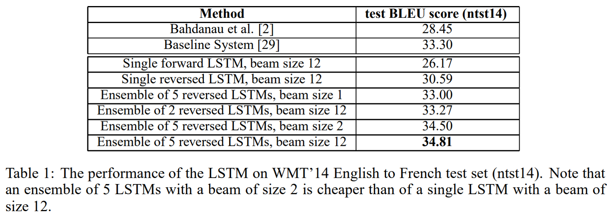
    

    1. 深度 LSTM 表現的會比單層 LSTM 好
    2. Beam Search 的使用似乎並不會對結果有太大的影響
   
  - 下表為與 **Baseline 的比較** 與 **反轉輸入序列** 的實驗結果
    

    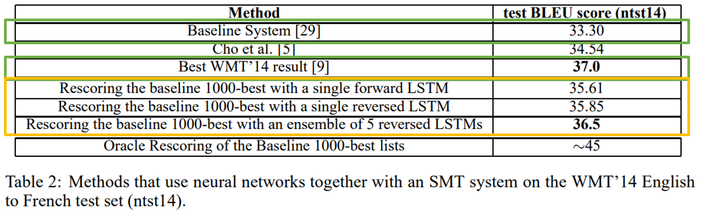
    

    1. 我們先看紅色標記的框框，實驗中的所有方法表現的都比 Baseline 好，而且和以往的 Best Result 比較起來，本論文也只小小輸了 0.5 BLEU score  
      這對當時有相當大的意義：這是在機器翻譯的任務上，史上第一次純用深度學習的方法(NMT) 贏過 使用統計機器學習方法(SMT)
    2. 黃色標記框框內的資料，表示輸入序列有經反轉的效果會表現得比沒反轉的好
* 模型分析
  - Seq2seq 可以理解每個句子間的相關性為何
    - 下圖為每個句子經過 Seq2seq 處理後，映射到二為平面的例子
    - 句意越相近的句子，兩者的距離越進；句意越不同的句子，兩者距離則越遠
    

    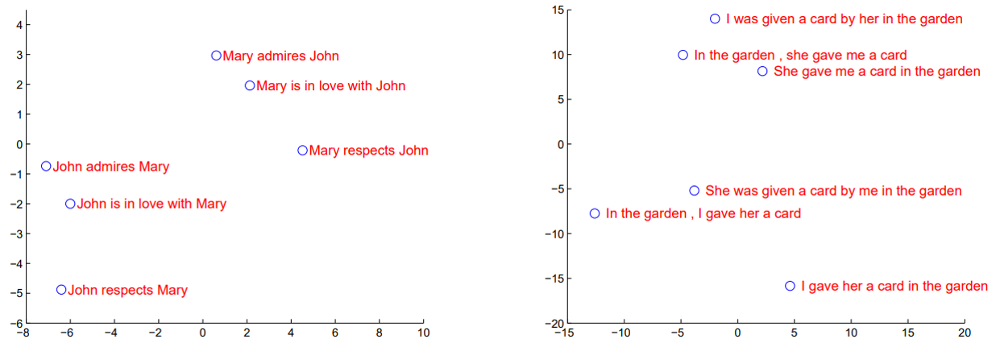
    

  - Seq2seq 並不會因為輸入序列長而表現不好
    - 下圖中，左表可以看到：幫句子長度在 79 以前，Seq2seq (表中以 LSTM 表示) 表現的還是會越來越好
      - 這在當時是讓人意外的，因為往常會認為輸入序列一長，LSTM 就很有可能訓練不起來
      - 能有這種結果的一部份原因，作者歸功於"有做輸入序列反轉"
    - 右表想表達：Seq2seq 在字彙量越大時，表現可能會越來越不好，但是在字彙量 2500 上下之前，Seq2seq 都是贏果 SMT 的
      - 這意味著："沒有已知所有單字"的深度學習方法都能贏過"已知所有單字"的統計機器學習方法了，未來只要在做一些調整，這篇論文的 Model 勢必對未來能有重大影響
## Conclusion
* 作者們對於 "反種輸入序列" 帶來的重大效益表示相當驚訝
* 作者也對 LSTM 能夠學習較長句子感到意外
* 這篇論文也證明了一個簡單、直觀、且相對並未最佳化的模型都能夠打敗 SMT 了，那 Seq2seq 的未來深不可測