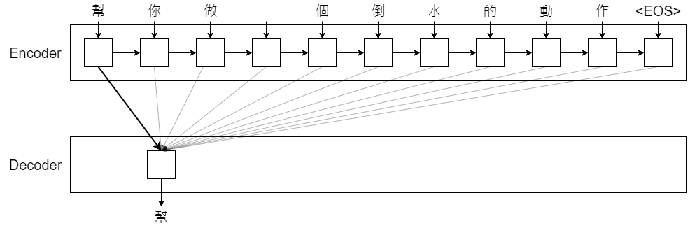
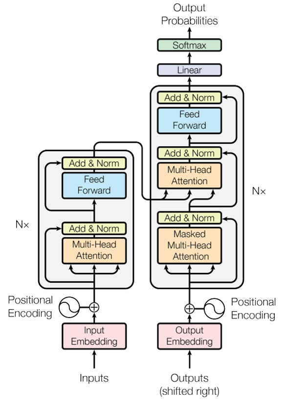

# Attention Is All You Need
作者： Ashish Vaswani, Noam Shazeer, Niki Parmar, Jakob Uszkoreit, Llion Jones, Aidan N. Gomez, Łukasz Kaiser, Illia Polosukhin  
Conference: NIPS 2017

## 先簡介一下 Transformer......
* 簡易解釋一下 Attention  
  (註：這邊只是做一個簡單的介紹，跟實作可能有一段落差)
  - 在下圖中，你第一眼注意到的是什麼呢？
    

    
    

    正常情況下，我們第一眼看到的會是照片最前面那隻橘貓，可能多看幾眼才會發現後面有一隻虎斑貓，再更仔細看一點的話，我們還會注意到左上角又一隻黑白花紋的貓
  - 上面的敘述，就是 Attention 要表達的概念：  
    一段很長的資料，可能只有少部分是真正重要的。
    所以 Attention 就是在這些資料中，找到重點的部分，並專處處理這些部分就好
  - 再舉個例子：
    假設我們輸入一個句子 "幫你做一個倒水的動作"，我們希望 Attention 能在這個句子中找到重點
    

    
    

    第一步：Attention 會先讀整個句子，並輸出這句話取重點後的第一個字是什麼，例子中輸出了 "幫"
    

    
    

    再來要輸出下一個字，所以 Attention 會讀取輸入中包含上一次輸出提取倒的部分以後的所有輸入再處理一次。例子中就是讀取輸入序列中，包含 "幫" 以後的所有元素，經過計算後，輸出了下一個重點字 "你 "
    

    
    
    
    

    就這樣一直重複，最後成功把 "幫你做一個倒水的動作" 簡化成 "幫你倒水"
* 那為什麼提出 Transformer？
  - 通常 Seq2seq 的內部架構會用 RNN、CNN，然而：
    - RNN: 會有梯度消失問題，且**無法平行計算** (一個 Seqence 丟進 RNN後，RNN 輸出序列的每個元素都必須等前一項元素計算完畢才能做運算，不能直接個算各的)
    - CNN: 雖然能夠平行運算了，但**計算量會和序列長度成正比**
  - 所以， Transformer 主打的就是不用 RNN、CNN，完全使用 Attention 架構 (準確來說是 Self-Attention)，就可以同時解決前述兩者的問題

##  這邊開始從論文脈絡做整理
### Introduction
* RNN (尤其 LSTM、GRU) 在 Seq2seq 議題上已經有相當頂尖的表現
* 但 RNN 的特性導致無法做平行處理，若序列長度一長，記憶體就會限制倒訓練資料的 Batch 數量
* **所以這篇論文提出了 Transformer 架構**：
  - 捨棄 RNN，完全用 Attention 架構去做
  - 這樣就可以實現平行運算，經過實驗後還發現這種作法能夠達到 state-of-the-art

### Background
* Extended Neural GPU, ByteNet and ConvS2S
  - 這三種架構都是基於 CNN 去實現的 (其中 ConvS2S 是由 Facebook 提出)，以達成平行運算的目的
  - 但如果輸入/輸出序列變長，要計算序列兩元素的關係也會受到影響 (如果有一個很長的序列，偏偏這個序列的頭、尾是有相關性的，那 CNN 在做卷積時，Kernel 也要很大才有辦法處理)
* Self-Attention
  - 一種專注在一個單一序列中各個位置元素間的關係的 Attention 機制
* Transformer
  - 本論文提出，首個完全使用 Self-Attention 的 Seq2seq

### Model Archiecture
本論文的整體架構如下圖

如同一般 Seq2seq，也是 encoder-decoder 架構

